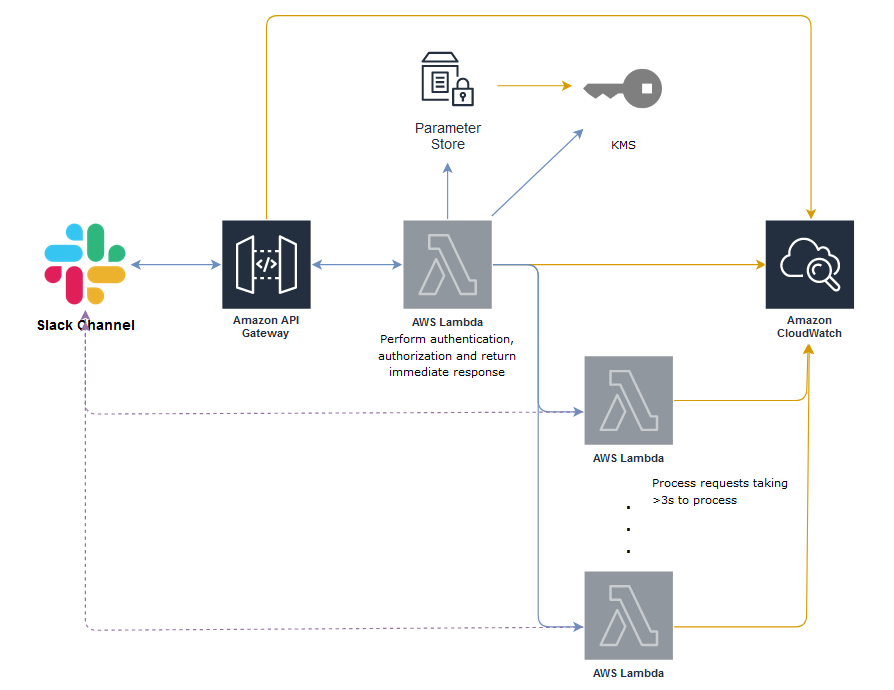
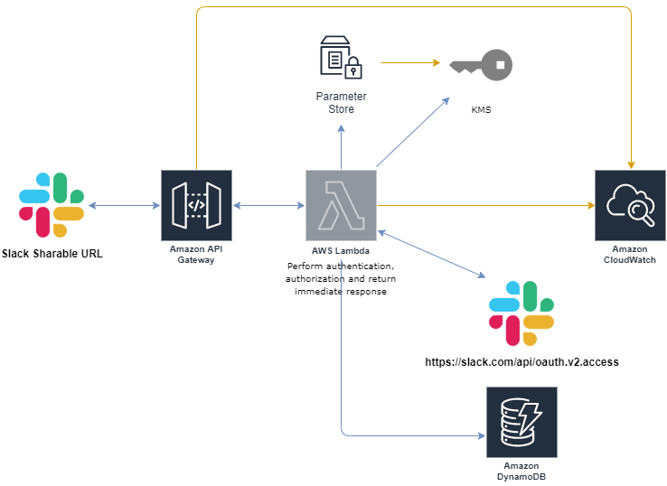
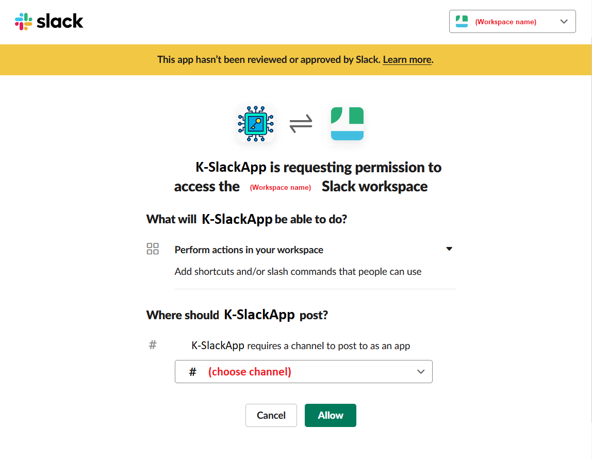
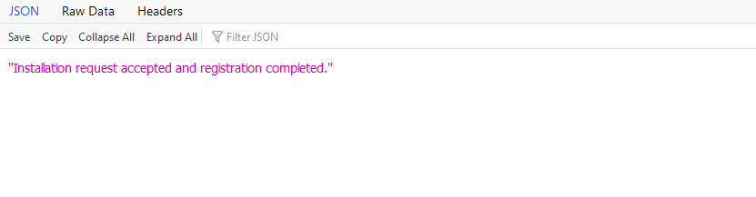

# slack-command-app-cdk

[](https://github.com/kyhau/slack-command-app-cdk/actions)
[](https://travis-ci.org/kyhau/slack-command-app-cdk)

This repo provides the source code for building

1. A [Slack Command](https://api.slack.com/interactivity/slash-commands) App/Bot with AWS API Gateway and Lambda Functions, deploying with [CDK v2](https://docs.aws.amazon.com/cdk/latest/guide/work-with-cdk-v2.html) and testing wth SAM CLI ([sam-beta-cdk](https://docs.aws.amazon.com/serverless-application-model/latest/developerguide/serverless-cdk-getting-started.html)).

2. An OAuth 2.0 authorization flow service for sharing the Slack App with other Workspaces without registering in the public Slack App Directory. For details see "Apps distributed to multiple workspaces" in [Distributing Slack apps](https://api.slack.com/start/distributing#multi_workspace_apps). This stack includes an AWS API Gateway, a Lambda Function, and a DynamoDB table, with AWS WAF (optional).

This SlackApp can handle requests triggered from a [Slash Command](https://api.slack.com/interactivity/slash-commands) which will take longer than [3 seconds](https://api.slack.com/events-api) to process, and posts the details back to the user.

---

## Overview

### Slack App Architecture



1. An API Gateway to provide an endpoint to be invoked from a Slack Command.
2. A Lambda Function [lambda/ImmediateResponse.py](lambda/ImmediateResponse.py) to perform authentication, some basic checks and send an intermediate response to Slack within 3 seconds (Slack requirement). This function invokes another Lambda function to to the request tasks (synchronously invocation for quick task; asynchronous invocation for long tasks).
3. A Lambda Function [lambda/AsyncWorker.py](lambda/AsyncWorker.py) to perform actual operation that may take more than 3 seconds to finish.
4. A Lambda Function [lambda/SyncWorker.py](lambda/SyncWorker.py) to perform actual operation that takes less than 3 seconds to finish.
6. CloudWatch Loggroup for API Gateway and Lambda Functions.

### OAuth 2.0 API Architecture



1. An API Gateway to provide an endpoint as the Sharable URL in Slack.
2. A Lambda Function [lambda/OAuth.py](lambda/OAuth.py) to perform OAuth 2.0 flow and turn the auth code into access token then store it in a DynamoDB table.
3. A DynamoDB table for storing the auth request data and token.
4. CloudWatch Loggroup for API Gateway and Lambda Functions.

---

## Prerequisites

### Setup on Slack

To create a **Slack Command** in Slack (the default command in this repo is **`/testcdk`**)
1. Navigate to https://api.slack.com/apps.
2. Select **Create New App** and select **Slash Commands**.
3. Enter the name **`/testcdk`** for the command and click **Add Slash Command Integration**.
4. Enter the provided API endpoint URL in the URL field.
5. Copy the **Verification Token** from **Basic Information**.

### Setup secrets

- Use [scripts/create_ssm_parameters.py](scripts/create_ssm_parameters.py) to set up AWS SSM Parameter SecureString for storing the required secrets.

### Review and update app settings

- [env_dev.json](env_dev.json) and [env_prd.json](env_prd.json)
- [settings_dev.json](settings_dev.json) and [settings_prd.json](settings_prd.json)

---

## Local Development, Build, Test and Deploy

Prerequisites
1. Install CDK v2: `npm install -g aws-cdk@next`
2. Install Python 3.8 or above.
3. Update [env_dev.json](env_dev.json) with you AWS account number and region that the Slack App is being deployed to.
4. Update [settings_dev.json](settings_dev.json) to include the Slack domains, team IDs and channel IDs that the Slack App serves.

```bash
# Create and activate virtual env (optional)

# Install requirements
pip install -r requirements.txt

# First time
cdk bootstrap
# Or
cdk ls

cdk synth
```

### Run unit tests and flake8 lint tests

```
python lambda/ImmediateResponse.test.py
python lambda/AsyncWorker.test.py
python lambda/SyncWorker.test.py
python lambda/OAuth.test.py

flake8 --ignore E501,F541,W605 lambda/ slack_app_constructs_cdk/ scripts/*.py
```

### Test Lambda function locally with AWS SAM CLI and AWS CDK

Prerequisites:
1. Install [sam-beta-cdk](https://docs.aws.amazon.com/serverless-application-model/latest/developerguide/serverless-cdk-getting-started.html)
2. Start Docker

```bash
# Prepare the deployment artifacts
sam-beta-cdk build

# Invoke the function STACK_NAME/FUNCTION_IDENTIFIER
sam-beta-cdk local invoke K-CDK-SlackApp/K-CDK-SlackApp-ImmediateResponse -e tests/event_async.json
sam-beta-cdk local invoke K-CDK-SlackApp/K-CDK-SlackApp-ImmediateResponse -e tests/event_sync.json

# To start the API declared in the AWS CDK application
sam-beta-cdk local start-api

# To start a local endpoint that emulates AWS Lambda
sam-beta-cdk local start-lambda
```

For details of sam-beta-cdk, see https://docs.aws.amazon.com/serverless-application-model/latest/developerguide/serverless-cdk-testing.html.

### Deploy

```bash
cdk deploy K-CDK-SlackApp

rm -rf cdk.out package */__pycache__ */*.egg-info */out.json
```

## Try it on Slack

E.g. if command is `/testcdk`, then

1. Run `/testcdk async`
2. Run `/testcdk sync`

---

## Protecting the API Gateways with AWS WAF

1. Add `AWS::WAFv2::RuleGroup` to protect the Slack App API Gateway by specifying rules such as
    1. ByteMatchStatement: SearchString: Slackbot 1.0 (+https://api.slack.com/robots)
    2. ByteMatchStatement: SearchString: team_id=TODO-slack-team-id
    3. ByteMatchStatement: SearchString: team_domain=TODO-slack-domain

---

## To Share the Slack App with other Workspaces

In order to share a Slack App with other Workspaces without registering in the public Slack App Directory, you will need to deploy also the following stack of the OAuth 2.0 authorization flow service.

For details see "Apps distributed to multiple workspaces" in [Distributing Slack apps](https://api.slack.com/start/distributing#multi_workspace_apps).

For details of Slack OAuth 2.0 v2 see
- https://api.slack.com/authentication/oauth-v2
- https://api.slack.com/methods/oauth.v2.access


[lambda/OAuth.py](lambda/OAuth.py) also performs further authorization check with `team_id` (and `channel_id`).

### Deploy

You will need to deploy also the following stack, which will create another service for for performing the OAuth 2.0 flow and turn the auth code into access token then store the details in a AWS DynamoDB table.

```
cdk deploy K-CDK-SlackApp-OAuth
```

### Steps to Install

#### From Slack App Owner

1. Ask the potential user to provide
    1. `team_id` (aka. Workspace ID)
    2. `channel_id`

2. Add to [settings_dev.json](settings_dev.json)

3. Deploy the stacks again.

4. Provide the users the **Sharable URL**. You can obtain this by going to **Settings | Manage Distribution | Sharable URL**.

#### From Slack App User

1. Log in to your Slack Workspace _**in a browser**_.

2. Open the **Sharable URL** in the browser. You will be asked to allow the access "Add shortcuts and/or slash commands that people can use".
   1. Select the channel where the Slack App will be installed.
   2. Click **Allow**.

   

3. On success of authenticating your request with the `team_id` and `channel_id`, you should see
   > Installation request accepted and registration completed.
   

4. Then in the channel you specified in previous step, you should see
   > added an integration to this channel: (you-app-name)

   You should be able to see this Slack App under **App** as well.

5. You can try
   ```
   /testcdk
   ```

Note that your Slack Workspace may have additional restriction and require Approval from Admin on installing new Slack App. In this case, you need to talk to your Slack Workspace Admin.


## Notes on known sam-beta-cdk issues

1. KeyError when running `sam-beta-cdk ...`
   ```bash
   KeyError: '/home/.../lambda'
   Failed to execute script __main__
   ```
   - Known bug: https://github.com/aws/aws-sam-cli/issues/2849
   - Workaround:
       - Add `"@aws-cdk/core:newStyleStackSynthesis": false` into cdk.json
       - Add an empty requirements.txt to [lambda/](lambda/).
